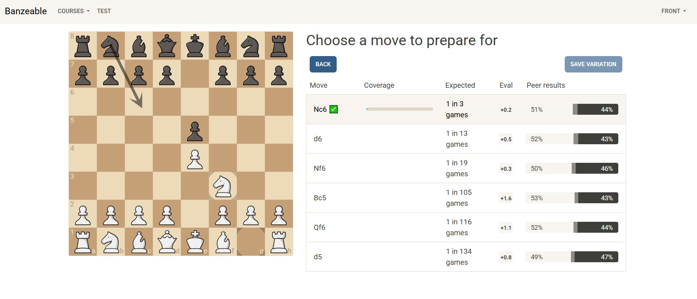
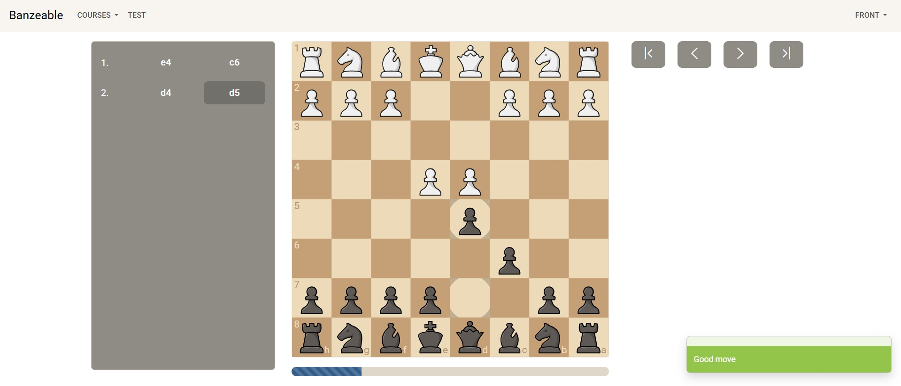

# Banzeable

A web application to build and explore chess openings based on real game data.

The project leverages data from Lichess to suggest the most played moves and help structure opening repertoires.

---

## 🎯 Purpose

Studying chess openings can be complex due to the large number of possible variations.

This project was designed to:

* Help build opening repertoires interactively
* Suggest moves based on real player data
* Explore opening trees in a structured way

It was inspired by tools like Chessbook and Chessable, with a focus on data-driven decision making.

---

## 🚀 Features

* Build opening repertoires move by move
* Suggest next moves based on Lichess API data
* Display move popularity (based on real games)
* Navigate through opening trees
* Dynamic updates using Mercure

---

## 🛠️ Tech Stack

* Backend: Symfony 7
* Frontend: Symfony UX (Turbo & Stimulus)
* Real-time updates: Mercure
* External API: Lichess API

---

## 📸 Screenshots

### Opening Tree



### Move Review



---

## ⚙️ Installation

```bash
git clone https://github.com/bidouillie/banzeable.git
cd banzeable
composer install
symfony server:start
```

---

## ⚠️ Known Limitations

This project is not fully complete.

One of the main challenges encountered was handling complex opening trees where multiple branches converge.
This made it difficult to compute accurate progress metrics (e.g. percentage of completion of an opening), especially when recalculations were required across shared nodes.

Despite several attempts, this part remains an open problem in the project.

---

## 🧠 What I Learned

* Working with tree-like data structures (chess opening variations)
* Integrating external APIs (Lichess)
* Handling real-time updates with Mercure
* Managing dynamic UI with Symfony UX (Turbo & Stimulus)
* Dealing with complex data consistency and recalculation challenges

---

## 🧩 Future Improvements

* Improve calculation of opening completion percentages
* Optimize tree traversal and data structure design
* Add PGN import/export
* Improve UI/UX
* Add training/review mode (spaced repetition)

---

## 📌 Notes

This project reflects a strong focus on problem-solving and experimentation, especially around handling complex data relationships in a real-world use case.

This readme was generated using AI ;)